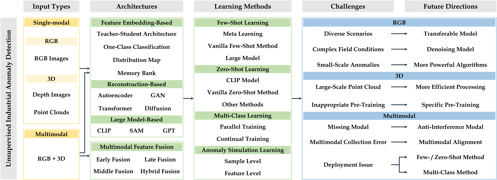
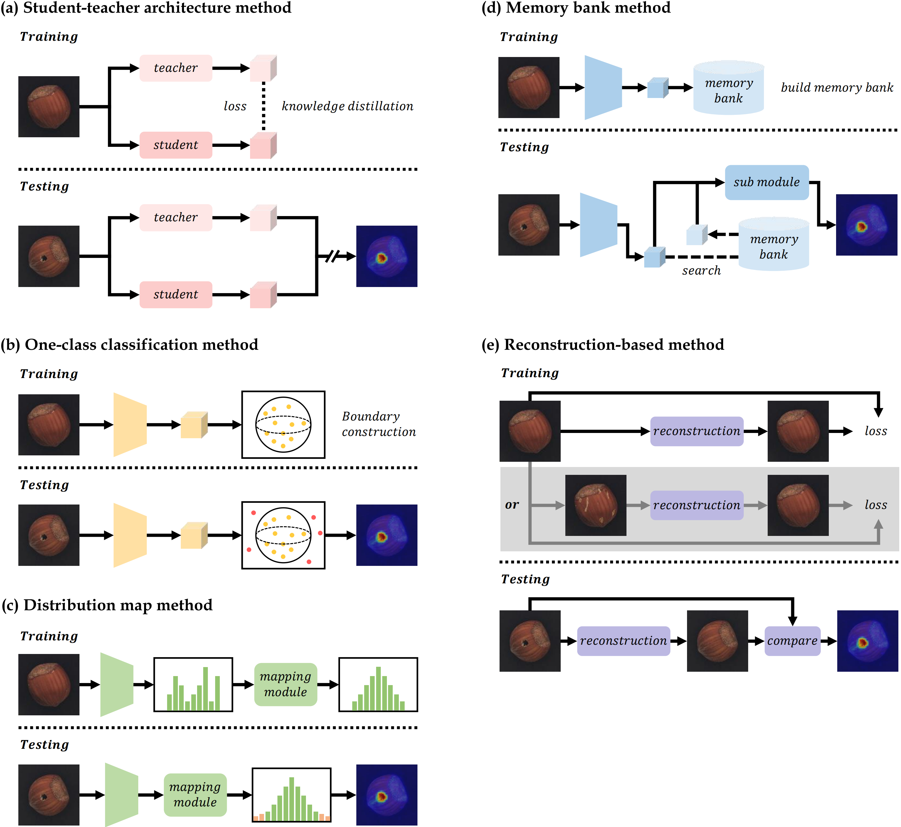

# Awesome-Multi-Setting-UIAD 
A taxonomy of Unsupervised Industrial Anomaly Detection (UIAD) methods and datasets (updating).

Welcome to follow our papers [**"A Survey on RGB, 3D, and Multimodal Approaches for Unsupervised Industrial Anomaly Detection"**](https://arxiv.org/abs/2410.21982).

If you find any errors in our survey and resource repository, or if you have any suggestions, please feel free to contact us via email at: olsunnylo@outlook.com.

# Contents
- [Overview](#overview)
  - [Roadmap](#roadmap)
  - [Paradigms](#paradigms)
- [RGB UIAD](#rgb-uiad)
  - [Datasets](#datasets)
  - [Methods](#methods-1)
- [3D UIAD](#3d-uiad)
  - [Datasets](#datasets-1)
  - [Methods](#methods-2)
- [Multimodal UIAD](#multimodal-uiad)
  - [Datasets](#datasets-2)
  - [Methods](#methods-3)

# Overview
## Roadmap

## Methods

# RGB UIAD

## Datasets
|  Dataset  |   Resource   |   Year   |   Type   |   Train   |    Test (good)   |   Test (anomaly)   |   Val   |   Total   |   Class   |    Anomaly Type   |    Modal Type   |
|:--------|:--------:|:--------:|:--------:|:--------:|:--------:|:--------:|:--------:|:--------:|:--------:|:--------:|:--------:|
| [**MVTec AD**](https://openaccess.thecvf.com/content_CVPR_2019/html/Bergmann_MVTec_AD_--_A_Comprehensive_Real-World_Dataset_for_Unsupervised_Anomaly_CVPR_2019_paper.html)   | [Data](https://www.mvtec.com/company/research/datasets/mvtec-ad) | 2019 | Real | 3629 | 467 | 1258 | - | 5354 | 15 | 73 | RGB |
| [**BTAD**](https://ieeexplore.ieee.org/document/9576231)   | [Data](https://avires.dimi.uniud.it/papers/btad/btad.zip) | 2021 | Real | 1799 | 451 | 290 | - | 2540 | 3 | - | RGB |
| [**MPDD**](https://ieeexplore.ieee.org/document/9631567)   | [Data](https://vutbr-my.sharepoint.com/personal/xjezek16_vutbr_cz/_layouts/15/onedrive.aspx?id=%2Fpersonal%2Fxjezek16%5Fvutbr%5Fcz%2FDocuments%2FMPDD&ga=1) | 2021 | Real | 888 | 176 | 282 | - | 1346 | 6 | - | RGB |
| [**MVTec LOCO-AD**](https://link.springer.com/article/10.1007/s11263-022-01578-9)   | [Data](https://www.mvtec.com/company/research/datasets/mvtec-loco) | 2022 | Real | 1772 | 575 | 993 | 304 | 3644 | 5 | 89 | RGB |
| [**VisA**](https://www.ecva.net/papers/eccv_2022/papers_ECCV/html/2149_ECCV_2022_paper.php)   | [Data](https://amazon-visual-anomaly.s3.us-west-2.amazonaws.com/VisA_20220922.tar) | 2022 | Real | 9621 | 0 | 1200 | - | 10821 | 12 | - | RGB |
| [**GoodsAD**](https://ieeexplore.ieee.org/document/10387569)   | [Data](https://github.com/jianzhang96/GoodsAD) | 2023 | Real | 3136 | 1328 | 1660 | - | 6124 | 6 | - | RGB |
| [**MSC-AD**](https://ieeexplore.ieee.org/abstract/document/10376373)   | - | 2023 | Real | 6480 | 2160 | 1080 | - | 9720 | 12 | 5 | RGB |
| [**CID**](https://ieeexplore.ieee.org/document/10504848)   | [Data](https://github.com/Light-ZhangTao/Insulator-Defect-Detection) | 2024 | Real | 3900 | 33 | 360 | - | 4293 | 1 | 6 | RGB |
| [**Real-IAD**](https://openaccess.thecvf.com/content/CVPR2024/html/Wang_Real-IAD_A_Real-World_Multi-View_Dataset_for_Benchmarking_Versatile_Industrial_Anomaly_CVPR_2024_paper.html)   | [Data](https://realiad4ad.github.io/Real-IAD/) | 2024 | Real | 72840 | 0 | 78210 | - | 151050 | 30 | 8 | RGB |
| [**RAD**](https://arxiv.org/abs/2406.07176)   | [Data](https://github.com/hustCYQ/RAD-dataset) | 2024 | Real | 213 | 73 | 1224 | - | 1510 | 4 | - | RGB |
| [**MIAD**](https://openaccess.thecvf.com/content/ICCV2023W/LIMIT/html/Bao_MIAD_A_Maintenance_Inspection_Dataset_for_Unsupervised_Anomaly_Detection_ICCVW_2023_paper.html)   | [Data](https://miad-2022.github.io/) | 2023 | Synthetic | 70000 | 17500 | 17500 | - | 105000 | 7 | 13 | RGB |
| [**MAD-Sim**](https://proceedings.neurips.cc/paper_files/paper/2023/hash/8bc5aef775aacc1650a9790f1428bcea-Abstract-Datasets_and_Benchmarks.html)   | [Data](https://drive.google.com/file/d/1XlW5v_PCXMH49RSKICkskKjd2A5YDMQq/view?usp=sharing) | 2023 | Synthetic | 4200 | 638 | 4951 | - | 9789 | 20 | 3 | RGB |
| [**DTD-Synthetic**](https://openaccess.thecvf.com/content/WACV2023/html/Aota_Zero-Shot_Versus_Many-Shot_Unsupervised_Texture_Anomaly_Detection_WACV_2023_paper.html)   | [Data](https://drive.google.com/drive/folders/10OyPzvI3H6llCZBxKxFlKWt1Pw1tkMK1) | 2024 | Synthetic | 1200 | 357 | 947 | - | 2504 | 12 | - | RGB |
<!-- | [**dataset**](web)   | [data](data_web) | - | - | - | - | - | - | - | - | - | - | -->

## Methods
|  Name  |  Title  |   Publication  |   Year   |   Code   |   Paradigm   |
|:--------|:--------|:--------:|:--------:|:--------:|:--------:|
| US | [**Uninformed Students: Student-Teacher Anomaly Detection With Discriminative Latent Embeddings**](https://openaccess.thecvf.com/content_CVPR_2020/html/Bergmann_Uninformed_Students_Student-Teacher_Anomaly_Detection_With_Discriminative_Latent_Embeddings_CVPR_2020_paper.html)   | CVPR | 2020 | [Code](https://github.com/denguir/student-teacher-anomaly-detection) | Teacher-student architecture |
| MKD | [**Multiresolution knowledge distillation for anomaly detection**](https://openaccess.thecvf.com/content/CVPR2021/html/Salehi_Multiresolution_Knowledge_Distillation_for_Anomaly_Detection_CVPR_2021_paper.html)   | CVPR | 2021 | [Code](https://github.com/rohban-lab/Knowledge_Distillation_AD) | Teacher-student architecture |
| GP | [**Glancing at the patch: Anomaly localization with global and local feature comparison**](https://openaccess.thecvf.com/content/CVPR2021/html/Wang_Glancing_at_the_Patch_Anomaly_Localization_With_Global_and_Local_CVPR_2021_paper.html)   | CVPR | 2021 | - | Teacher-student architecture |
| RD4AD | [**Anomaly Detection via Reverse Distillation From One-Class Embedding**](https://openaccess.thecvf.com/content/CVPR2022/html/Deng_Anomaly_Detection_via_Reverse_Distillation_From_One-Class_Embedding_CVPR_2022_paper.html)   | CVPR | 2022 | [Code](https://github.com/hq-deng/RD4AD) | Teacher-student architecture |
| PFM | [**Unsupervised Image Anomaly Detection and Segmentation Based on Pretrained Feature Mapping**](https://ieeexplore.ieee.org/abstract/document/9795121)   | TII | 2023 | [Code](https://github.com/smiler96/PFM-and-PEFM-for-Image-Anomaly-Detection-and-Segmentation) | Teacher-student architecture |
| MemKD | [**Remembering Normality: Memory-guided Knowledge Distillation for Unsupervised Anomaly Detection**](https://openaccess.thecvf.com/content/ICCV2023/html/Gu_Remembering_Normality_Memory-guided_Knowledge_Distillation_for_Unsupervised_Anomaly_Detection_ICCV_2023_paper.html)   | ICCV | 2023 | [Code](https://github.com/SimonThomine/RememberingNormality) | Teacher-student architecture |
| DeSTSeg | [**DeSTSeg: Segmentation Guided Denoising Student-Teacher for Anomaly Detection**](https://openaccess.thecvf.com/content/CVPR2023/html/Zhang_DeSTSeg_Segmentation_Guided_Denoising_Student-Teacher_for_Anomaly_Detection_CVPR_2023_paper.html)   | CVPR | 2023 | [Code](https://github.com/apple/ml-destseg) | Teacher-student architecture |
| EfficientAD | [**EfficientAD: Accurate Visual Anomaly Detection at Millisecond-Level Latencies**](https://openaccess.thecvf.com/content/WACV2024/html/Batzner_EfficientAD_Accurate_Visual_Anomaly_Detection_at_Millisecond-Level_Latencies_WACV_2024_paper.html)   | WACV | 2024 | [Unofficial Code](https://github.com/rximg/EfficientAD) | Teacher-student architecture |
| EMMFRKD | [**Enhanced multi-scale features mutual mapping fusion based on reverse knowledge distillation for industrial anomaly detection and localization**](https://ieeexplore.ieee.org/document/10382612)   | TBD | 2024 | - | Teacher-student architecture |
| AEKD | [**AEKD: Unsupervised auto-encoder knowledge distillation for industrial anomaly detection**](https://www.sciencedirect.com/science/article/abs/pii/S0278612524000244)   | JMS | 2024 | - | Teacher-student architecture |
| FCACDL | [**Feature-Constrained and Attention-Conditioned Distillation Learning for Visual Anomaly Detection**](https://ieeexplore.ieee.org/document/10448432)   | ICASSP | 2024 | - | Teacher-student architecture |
| DMDD | [**Dual-Modeling Decouple Distillation for Unsupervised Anomaly Detection**](https://dl.acm.org/doi/10.1145/3664647.3681669)   | ACM MM | 2024 | - | Teacher-student architecture |
| CutPaste | [**CutPaste: Self-Supervised Learning for Anomaly Detection and Localization**](https://openaccess.thecvf.com/content/CVPR2021/html/Li_CutPaste_Self-Supervised_Learning_for_Anomaly_Detection_and_Localization_CVPR_2021_paper.html)   | CVPR | 2021 | [Unofficial Code](https://github.com/LilitYolyan/CutPaste) | One-class classification |
| SimpleNet | [**SimpleNet: A Simple Network for Image Anomaly Detection and Localization**](https://openaccess.thecvf.com/content/CVPR2023/html/Liu_SimpleNet_A_Simple_Network_for_Image_Anomaly_Detection_and_Localization_CVPR_2023_paper.html)   | CVPR | 2023 | [Code](https://github.com/DonaldRR/SimpleNet) | One-class classification |
| ADShift | [**Anomaly Detection Under Distribution Shift**](https://openaccess.thecvf.com/content/ICCV2023/html/Cao_Anomaly_Detection_Under_Distribution_Shift_ICCV_2023_paper.html)   | ICCV | 2023 | [Code](https://github.com/mala-lab/ADShift) | One-class classification |
| DS2 | [**Learning Transferable Representations for Image Anomaly Localization Using Dense Pretraining**](https://openaccess.thecvf.com/content/WACV2024/html/He_Learning_Transferable_Representations_for_Image_Anomaly_Localization_Using_Dense_Pretraining_WACV_2024_paper.html)   | WACV | 2024 | - | One-class classification |
| GeneralAD | [**GeneralAD: Anomaly Detection Across Domains by Attending to Distorted Features**](https://arxiv.org/abs/2407.12427)   | ECCV | 2024 | [Code](https://github.com/LucStrater/GeneralAD) | One-class classification |
| GLASS | [**A Unified Anomaly Synthesis Strategy with Gradient Ascent for Industrial Anomaly Detection and Localization**](https://arxiv.org/abs/2407.09359)   | ECCV | 2024 | [Code](https://github.com/cqylunlun/GLASS) | One-class classification |
| FastFlow | [**FastFlow: Unsupervised Anomaly Detection and Localization via 2D Normalizing Flows**](https://arxiv.org/abs/2111.07677)   | - | 2021 | [Unofficial Code](https://github.com/gathierry/FastFlow) | Distribution map |
| DifferNet | [**Same Same but DifferNet: Semi-Supervised Defect Detection With Normalizing Flows**](https://openaccess.thecvf.com/content/WACV2021/html/Rudolph_Same_Same_but_DifferNet_Semi-Supervised_Defect_Detection_With_Normalizing_Flows_WACV_2021_paper.html)   | WACV | 2021 | [Code](https://github.com/marco-rudolph/differnet) | Distribution map |
| CFLOW-AD | [**CFLOW-AD: Real-Time Unsupervised Anomaly Detection With Localization via Conditional Normalizing Flows**](https://openaccess.thecvf.com/content/WACV2022/html/Gudovskiy_CFLOW-AD_Real-Time_Unsupervised_Anomaly_Detection_With_Localization_via_Conditional_Normalizing_WACV_2022_paper.html)   | WACV | 2022 | [Code](https://github.com/gudovskiy/cflow-ad) | Distribution map |
| CS-Flow | [**Fully Convolutional Cross-Scale-Flows for Image-Based Defect Detection**](https://openaccess.thecvf.com/content/WACV2022/html/Rudolph_Fully_Convolutional_Cross-Scale-Flows_for_Image-Based_Defect_Detection_WACV_2022_paper.html)   | WACV | 2022 | [Code](https://github.com/marco-rudolph/cs-flow) | Distribution map | |
| CDO | [**Collaborative Discrepancy Optimization for Reliable Image Anomaly Localization**](https://ieeexplore.ieee.org/document/10034849)   | TII | 2023 | [Code](https://github.com/caoyunkang/CDO) | Distribution map |
| PyramidFlow | [**PyramidFlow: High-Resolution Defect Contrastive Localization Using Pyramid Normalizing Flow**](https://openaccess.thecvf.com/content/CVPR2023/html/Lei_PyramidFlow_High-Resolution_Defect_Contrastive_Localization_Using_Pyramid_Normalizing_Flow_CVPR_2023_paper.html)   | CVPR | 2023 | [Code](https://github.com/gasharper/PyramidFlow) | Distribution map |
| SLAD | [**Fascinating Supervisory Signals and Where to Find Them: Deep Anomaly Detection with Scale Learning**](https://openreview.net/forum?id=V6PNBRWRil)   | ICML | 2023 | [Code](https://github.com/xuhongzuo/scale-learning) | Distribution map |
| MSFlow | [**MSFlow: Multiscale Flow-Based Framework for Unsupervised Anomaly Detection**](https://ieeexplore.ieee.org/document/10384766)   | TNNLS | 2024 | [Code](https://github.com/cool-xuan/msflow) | Distribution map |
| AttentDifferNet | [**Attention Modules Improve Image-Level Anomaly Detection for Industrial Inspection: A DifferNet Case Study**](https://openaccess.thecvf.com/content/WACV2024/html/Vieira_e_Silva_Attention_Modules_Improve_Image-Level_Anomaly_Detection_for_Industrial_Inspection_A_WACV_2024_paper.html)   | WACV | 2024 | [Code](https://github.com/andreluizbvs/AttentDifferNet) | Distribution map |
| PaDiM | [**PaDiM: A Patch Distribution Modeling Framework for Anomaly Detection and Localization**](https://link.springer.com/chapter/10.1007/978-3-030-68799-1_35)   | ICPR | 2021 | [Unofficial Code](https://github.com/xiahaifeng1995/PaDiM-Anomaly-Detection-Localization-master) | Memory bank |
| PatchCore | [**Towards Total Recall in Industrial Anomaly Detection**](https://openaccess.thecvf.com/content/CVPR2022/html/Roth_Towards_Total_Recall_in_Industrial_Anomaly_Detection_CVPR_2022_paper.html)   | CVPR | 2022 | [Code](https://github.com/amazon-science/patchcore-inspection) | Memory bank |
| CFA | [**CFA: Coupled-Hypersphere-Based Feature Adaptation for Target-Oriented Anomaly Localization**](https://ieeexplore.ieee.org/abstract/document/9839549)   | IEEE Access | 2022 | [Code](https://github.com/sungwool/CFA_for_anomaly_localization) | Memory bank |
| DMAD | [**Diversity-Measurable Anomaly Detection**](https://openaccess.thecvf.com/content/CVPR2023/html/Liu_Diversity-Measurable_Anomaly_Detection_CVPR_2023_paper.html)   | CVPR | 2023 | [Code](https://github.com/FlappyPeggy/DMAD) | Memory bank |
| PNI | [**PNI : Industrial Anomaly Detection using Position and Neighborhood Information**](https://openaccess.thecvf.com/content/ICCV2023/html/Bae_PNI__Industrial_Anomaly_Detection_using_Position_and_Neighborhood_Information_ICCV_2023_paper.html)   | ICCV | 2023 | [Code](https://github.com/wogur110/PNI_anomaly_detection) | Memory bank |
| GraphCore | [**Pushing the Limits of Fewshot Anomaly Detection in Industry Vision: Graphcore**](https://openreview.net/forum?id=xzmqxHdZAwO)   | ICLR | 2023 | - | Memory bank |
| InReaCh | [**Inter-Realization Channels: Unsupervised Anomaly Detection Beyond One-Class Classification**](https://openaccess.thecvf.com/content/ICCV2023/html/McIntosh_Inter-Realization_Channels_Unsupervised_Anomaly_Detection_Beyond_One-Class_Classification_ICCV_2023_paper.html)   | ICCV | 2023 | [Code](https://github.com/DeclanMcIntosh/InReaCh) | Memory bank |
| ReconFA | [**A Reconstruction-Based Feature Adaptation for Anomaly Detection with Self-Supervised Multi-Scale Aggregation**](https://ieeexplore.ieee.org/document/10446766)   | ICASSP | 2024 | - | Memory bank |
| ReConPatch | [**ReConPatch: Contrastive Patch Representation Learning for Industrial Anomaly Detection**](https://openaccess.thecvf.com/content/WACV2024/html/Hyun_ReConPatch_Contrastive_Patch_Representation_Learning_for_Industrial_Anomaly_Detection_WACV_2024_paper.html)   | WACV | 2024 | [Unofficial Code](https://github.com/travishsu/ReConPatch-TF) | Memory bank |
| AE-SSIM | [**Improving Unsupervised Defect Segmentation by Applying Structural Similarity to Autoencoders**](https://arxiv.org/abs/1807.02011)   | - | 2018 | [Unofficial Code](https://github.com/cheapthrillandwine/Improving_Unsupervised_Defect_Segmentation) | Autoencoder-based Reconstruction |
| DFR | [**Unsupervised anomaly segmentation via deep feature reconstruction**](https://www.sciencedirect.com/science/article/abs/pii/S0925231220317951)   | Neurocomputing | 2020 | [Code](https://github.com/YoungGod/DFR) | Autoencoder-based Reconstruction |
| DAAD | [**Divide-and-Assemble: Learning Block-Wise Memory for Unsupervised Anomaly Detection**](https://openaccess.thecvf.com/content/ICCV2021/html/Hou_Divide-and-Assemble_Learning_Block-Wise_Memory_for_Unsupervised_Anomaly_Detection_ICCV_2021_paper.html)   | ICCV | 2021 | - | Autoencoder-based Reconstruction |
| RIAD | [**Reconstruction by inpainting for visual anomaly detection**](https://www.sciencedirect.com/science/article/abs/pii/S0031320320305094)   | PR | 2021 | [Unofficial Code](https://github.com/plutoyuxie/Reconstruction-by-inpainting-for-visual-anomaly-detection) | Autoencoder-based Reconstruction |
| DRÆM | [**DRAEM - A Discriminatively Trained Reconstruction Embedding for Surface Anomaly Detection**](https://openaccess.thecvf.com/content/ICCV2021/html/Zavrtanik_DRAEM_-_A_Discriminatively_Trained_Reconstruction_Embedding_for_Surface_Anomaly_ICCV_2021_paper.html)   | ICCV | 2021 | [Code](https://github.com/VitjanZ/DRAEM) | Autoencoder-based Reconstruction |
| DSR | [**DSR – A Dual Subspace Re-Projection Network for Surface Anomaly Detection**](https://www.ecva.net/papers/eccv_2022/papers_ECCV/html/7955_ECCV_2022_paper.php)   | ECCV | 2022 | [Code](https://github.com/VitjanZ/DSR_anomaly_detection) | Autoencoder-based Reconstruction |
| NSA | [**Natural Synthetic Anomalies for Self-Supervised Anomaly Detection and Localization**](https://link.springer.com/chapter/10.1007/978-3-031-19821-2_27)   | ECCV | 2022 | [Code](https://github.com/hmsch/natural-synthetic-anomalies) | Autoencoder-based Reconstruction |
| SSPCAB | [**Self-Supervised Predictive Convolutional Attentive Block for Anomaly Detection**](https://openaccess.thecvf.com/content/CVPR2022/html/Ristea_Self-Supervised_Predictive_Convolutional_Attentive_Block_for_Anomaly_Detection_CVPR_2022_paper.html)   | CVPR | 2022 | [Code](https://github.com/ristea/sspcab) | Autoencoder-based Reconstruction |
| SSMCTB | [**Self-Supervised Masked Convolutional Transformer Block for Anomaly Detection**](https://ieeexplore.ieee.org/document/10273635)   | TPAMI | 2024 | [Code](https://github.com/ristea/ssmctb) | Autoencoder-based Reconstruction |
| THFR | [**Template-guided Hierarchical Feature Restoration for Anomaly Detection**](https://openaccess.thecvf.com/content/ICCV2023/html/Guo_Template-guided_Hierarchical_Feature_Restoration_for_Anomaly_Detection_ICCV_2023_paper.html)   | ICCV | 2023 | - | Autoencoder-based Reconstruction |
| FastRecon | [**FastRecon: Few-shot Industrial Anomaly Detection via Fast Feature Reconstruction**](https://openaccess.thecvf.com/content/ICCV2023/html/Fang_FastRecon_Few-shot_Industrial_Anomaly_Detection_via_Fast_Feature_Reconstruction_ICCV_2023_paper.html)   | ICCV | 2023 | [Code](https://github.com/FzJun26th/FastRecon) | Autoencoder-based Reconstruction |
| RealNet | [**RealNet: A Feature Selection Network with Realistic Synthetic Anomaly for Anomaly Detection**](https://openaccess.thecvf.com/content/CVPR2024/html/Zhang_RealNet_A_Feature_Selection_Network_with_Realistic_Synthetic_Anomaly_for_CVPR_2024_paper.html)   | CVPR | 2024 | [Code](https://github.com/cnulab/RealNet) | Autoencoder-based Reconstruction |
| IFgNet | [**Implicit Foreground-Guided Network for Anomaly Detection and Localization**](https://ieeexplore.ieee.org/document/10446952)   | ICASSP | 2024 | [Code](https://github.com/gloriacxl/IFgNet) | Autoencoder-based Reconstruction |
| LAMP | [**Neural Network Training Strategy To Enhance Anomaly Detection Performance: A Perspective On Reconstruction Loss Amplification**](https://ieeexplore.ieee.org/document/10446942)   | ICASSP | 2024 | - | Autoencoder-based Reconstruction |
| PatchAnomaly | [**Patch-Wise Augmentation for Anomaly Detection and Localization**](https://ieeexplore.ieee.org/document/10446994)   | ICASSP | 2024 | - | Autoencoder-based Reconstruction |
| MAAE | [**Mixed-Attention Auto Encoder for Multi-Class Industrial Anomaly Detection**](https://ieeexplore.ieee.org/document/10446794)   | ICASSP | 2024 | - | Autoencoder-based Reconstruction |
| DC-AE | [**Dual-Constraint Autoencoder and Adaptive Weighted Similarity Spatial Attention for Unsupervised Anomaly Detection**](https://ieeexplore.ieee.org/document/10504620)   | TII | 2024 | - | Autoencoder-based Reconstruction |
| SCADN | [**Learning Semantic Context from Normal Samples for Unsupervised Anomaly Detection**](https://ojs.aaai.org/index.php/AAAI/article/view/16420)   | AAAI | 2021 | [Code](https://github.com/Xudong-Yan/SCADN) | GAN-based Reconstruction |
| OCR-GAN | [**Omni-Frequency Channel-Selection Representations for Unsupervised Anomaly Detection**](https://ieeexplore.ieee.org/document/10192551)   | TIP | 2023 | [Code](https://github.com/zhangzjn/OCR-GAN) | GAN-based Reconstruction |
| MeTAL | [**Masked Transformer for Image Anomaly Localization**](https://www.worldscientific.com/doi/abs/10.1142/S0129065722500307)   | IJNS | 2022 | - | Transformer-based Reconstruction |
| FOD | [**Focus the Discrepancy: Intra- and Inter-Correlation Learning for Image Anomaly Detection**](https://openaccess.thecvf.com/content/ICCV2023/html/Yao_Focus_the_Discrepancy_Intra-_and_Inter-Correlation_Learning_for_Image_Anomaly_ICCV_2023_paper.html)   | ICCV | 2023 | [Code](https://github.com/xcyao00/FOD) | Transformer-based Reconstruction |
| AMI-Net | [**AMI-Net: Adaptive Mask Inpainting Network for Industrial Anomaly Detection and Localization**](https://ieeexplore.ieee.org/abstract/document/10445116)   | TASE | 2024 | [Code](https://github.com/luow23/AMI-Net) | Transformer-based Reconstruction |
| PNPT | [**Prior Normality Prompt Transformer for Multiclass Industrial Image Anomaly Detection**](https://ieeexplore.ieee.org/document/10574313)   | TII | 2024 | - | Transformer-based Reconstruction |
| DDAD | [**Anomaly Detection with Conditioned Denoising Diffusion Models**](https://arxiv.org/abs/2305.15956)   | - | 2023 | [Code](https://github.com/arimousa/DDAD) | Diffusion-based Reconstruction |
| DiffAD | [**Unsupervised Surface Anomaly Detection with Diffusion Probabilistic Model**](https://openaccess.thecvf.com/content/ICCV2023/html/Zhang_Unsupervised_Surface_Anomaly_Detection_with_Diffusion_Probabilistic_Model_ICCV_2023_paper.html)   | ICCV | 2023 | - | Diffusion-based Reconstruction |
| RAN | [**Removing Anomalies as Noises for Industrial Defect Localization**](https://openaccess.thecvf.com/content/ICCV2023/html/Lu_Removing_Anomalies_as_Noises_for_Industrial_Defect_Localization_ICCV_2023_paper.html)   | ICCV | 2023 | - | Diffusion-based Reconstruction |
| TransFusion | [**TransFusion – A Transparency-Based Diffusion Model for Anomaly Detection**](https://link.springer.com/chapter/10.1007/978-3-031-72761-0_6)   | ECCV | 2024 | [Code](https://github.com/MaticFuc/ECCV_TransFusion) | Diffusion-based Reconstruction |
| DiAD | [**A Diffusion-Based Framework for Multi-Class Anomaly Detection**](https://ojs.aaai.org/index.php/AAAI/article/view/28690)   | AAAI | 2024 | [Code](https://github.com/lewandofskee/DiAD) | Diffusion-based Reconstruction |
| GLAD | [**GLAD: Towards Better Reconstruction with Global and Local Adaptive Diffusion Models for Unsupervised Anomaly Detection**](https://arxiv.org/abs/2406.07487)   | ECCV | 2024 | [Code](https://github.com/hyao1/GLAD) | Diffusion-based Reconstruction |
| AnomalySD | [**AnomalySD: Few-Shot Multi-Class Anomaly Detection with Stable Diffusion Model**](https://arxiv.org/abs/2408.01960)   | - | 2024 | - | Diffusion-based Reconstruction |
<!-- | name | [**title**](web)   | venue | year | [Code](code_web) | paradigm | -->

# 3D UIAD

## Datasets
|  Dataset  |   Resource   |   Year   |   Type   |   Train   |    Test (good)   |   Test (anomaly)   |   Val   |   Total   |   Class   |    Anomaly Type    |    Modal Type    |
|:--------|:--------:|:--------:|:--------:|:--------:|:--------:|:--------:|:--------:|:--------:|:--------:|:--------:|:--------:|
| [**Real3D-AD**](https://proceedings.neurips.cc/paper_files/paper/2023/hash/611b896d447df43c898062358df4c114-Abstract-Datasets_and_Benchmarks.html)   | [data](https://github.com/M-3LAB/Real3D-AD) | 2023 | Real | 48 | 604 | 602 | - | 1254 | 12 | 3 |  Point cloud |
| [**Anomaly-ShapeNet**](https://openaccess.thecvf.com/content/CVPR2024/html/Li_Towards_Scalable_3D_Anomaly_Detection_and_Localization_A_Benchmark_via_CVPR_2024_paper.html)   | [data](https://github.com/Chopper-233/Anomaly-ShapeNet) | 2023 | Synthetic | 208 | 780 | 943 | - | 1931 | 50 | 7 | Point cloud |
<!-- | [**dataset**](web)   | [data](data_web) | - | - | - | - | - | - | - | - | - | - | -->

## Methods
|  Name  |  Title  |   Publication  |   Year   |   Code   |   Paradigm   |
|:--------|:--------|:--------:|:--------:|:--------:|:--------:|
| 3D-ST | [**Anomaly Detection in 3D Point Clouds Using Deep Geometric Descriptors**](https://openaccess.thecvf.com/content/WACV2023/html/Bergmann_Anomaly_Detection_in_3D_Point_Clouds_Using_Deep_Geometric_Descriptors_WACV_2023_paper.html)   | WACV | 2023 | - | Teacher-student architecture |
| Reg3D-AD | [**Real3D-AD: A Dataset of Point Cloud Anomaly Detection**](https://proceedings.neurips.cc/paper_files/paper/2023/hash/611b896d447df43c898062358df4c114-Abstract-Datasets_and_Benchmarks.html)   | NeurIPS | 2024 | [Code](https://github.com/M-3LAB/Real3D-AD) | Memory bank |
| Group3AD | [**Towards High-resolution 3D Anomaly Detection via Group-Level Feature Contrastive Learning**](https://arxiv.org/abs/2408.04604)   | ACM MM | 2024 | [Code](https://github.com/M-3LAB/Group3AD) | Memory bank |
| PointCore | [**PointCore: Efficient Unsupervised Point Cloud Anomaly Detector Using Local-Global Features**](https://arxiv.org/abs/2403.01804)   | - | 2024 | - | Memory bank |
| R3D-AD | [**R3D-AD: Reconstruction via Diffusion for 3D Anomaly Detection**](https://link.springer.com/chapter/10.1007/978-3-031-72764-1_6)   | ECCV | 2024 | - | Reconstruction |
<!-- | name | [**title**](web)   | venue | year | [Code](code_web) | paradigm | -->

# Multimodal UIAD

## Datasets
|  Dataset  |   Resource   |   Year   |   Type   |   Train   |    Test (good)   |   Test (anomaly)   |   Val   |   Total   |   Class   |    Anomaly Type   |    Modal Type   |
|:--------|:--------:|:--------:|:--------:|:--------:|:--------:|:--------:|:--------:|:--------:|:--------:|:--------:|:--------:|
| [**MVTec 3D-AD**](https://www.scitepress.org/PublicationsDetail.aspx?ID=x2WTZgpY0KM=&t=1)   | [data](https://www.mvtec.com/company/research/datasets/mvtec-3d-ad) | 2021 | Real | 2656 | 294 | 948 | 294 | 4147 | 10 | 41 | RGB & Point cloud |
| [**PD-REAL**](https://arxiv.org/abs/2311.04095)   | [data](https://drive.google.com/file/d/1EBapy9BGnwmZJ9Rxh0uTF-Xii9FU0YCG/view?usp=sharing) | 2023 | Real | 2399 | 300 | 530 | 300 | 3529 | 15 | 6 | RGB & Point cloud |
| [**Eyecandies**](https://openaccess.thecvf.com/content/ACCV2022/html/Bonfiglioli_The_Eyecandies_Dataset_for_Unsupervised_Multimodal_Anomaly_Detection_and_Localization_ACCV_2022_paper.html)   | [data](https://eyecan-ai.github.io/eyecandies/download) | 2022 | Synthetic | 10000 | 2250 | 2250 | 1000 | 15500 | 10 | - | RGB & Depth |
<!-- | [**dataset**](web)   | [data](data_web) | - | - | - | - | - | - | - | - | - | - | -->

## Methods
|  Name  |  Title  |   Publication  |   Year   |   Code   |   Paradigm   |
|:--------|:--------|:--------:|:--------:|:--------:|:--------:|
| BTF | [**Back to the Feature: Classical 3D Features Are (Almost) All You Need for 3D Anomaly Detection**](https://openaccess.thecvf.com/content/CVPR2023W/VAND/html/Horwitz_Back_to_the_Feature_Classical_3D_Features_Are_Almost_All_CVPRW_2023_paper.html)   | CVPR | 2023 | [Code](https://github.com/eliahuhorwitz/3D-ADS) | - |
| AST | [**Asymmetric Student-Teacher Networks for Industrial Anomaly Detection**](https://openaccess.thecvf.com/content/WACV2023/html/Rudolph_Asymmetric_Student-Teacher_Networks_for_Industrial_Anomaly_Detection_WACV_2023_paper.html)   | WACV | 2023 | [Code](https://github.com/marco-rudolph/AST) | Teacher-student architecture |
| MMRD | [**Rethinking Reverse Distillation for Multi-Modal Anomaly Detection**](https://ojs.aaai.org/index.php/AAAI/article/view/28687)   | AAAI | 2024 | - | Teacher-student architecture |
| M3DM | [**Multimodal Industrial Anomaly Detection via Hybrid Fusion**](https://openaccess.thecvf.com/content/CVPR2023/html/Wang_Multimodal_Industrial_Anomaly_Detection_via_Hybrid_Fusion_CVPR_2023_paper.html)   | CVPR | 2023 | [Code](https://github.com/nomewang/M3DM) | Memory bank |
| CPMF | [**Complementary Pseudo Multimodal Feature for Point Cloud Anomaly Detection**](https://arxiv.org/abs/2303.13194)   | - | 2023 | [Code](https://github.com/caoyunkang/CPMF) | Memory bank |
| Shape-Guided | [**Shape-Guided Dual-Memory Learning for 3D Anomaly Detection**](https://proceedings.mlr.press/v202/chu23b.html)   | ICML | 2023 | [Code](https://github.com/jayliu0313/Shape-Guided) | Memory bank |
| LSFA | [**Self-supervised Feature Adaptation for 3D Industrial Anomaly Detection**](https://link.springer.com/chapter/10.1007/978-3-031-72627-9_5)   | ECCV | 2024 | [Code](https://github.com/yuanpengtu/LSFA) | Memory bank |
| ITNM | [**Incremental Template Neighborhood Matching for 3D anomaly detection**](https://dl.acm.org/doi/10.1016/j.neucom.2024.127483)   | Neurocomputing | 2024 | - | Memory bank |
| CMDIAD | [**Incomplete Multimodal Industrial Anomaly Detection via Cross-Modal Distillation**](https://arxiv.org/abs/2405.13571)   | - | 2024 | [Code](https://github.com/evenrose/CMDIAD) | Memory bank |
| M3DM-NR | [**M3DM-NR: RGB-3D Noisy-Resistant Industrial Anomaly Detection via Multimodal Denoising**](https://arxiv.org/abs/2406.02263)   | - | 2024 | - | Memory bank |
| EasyNet | [**EasyNet: An Easy Network for 3D Industrial Anomaly Detection**](https://dl.acm.org/doi/10.1145/3581783.3611876)   | ACM MM | 2023 | [Code](https://github.com/TaoTao9/EasyNet) | Reconstruction |
| DBRN | [**Dual-Branch Reconstruction Network for Industrial Anomaly Detection with RGB-D Data**](https://arxiv.org/abs/2311.06797)   | - | 2023 | - | Reconstruction |
| 3DSR | [**Cheating Depth: Enhancing 3D Surface Anomaly Detection via Depth Simulation**](https://openaccess.thecvf.com/content/WACV2024/html/Zavrtanik_Cheating_Depth_Enhancing_3D_Surface_Anomaly_Detection_via_Depth_Simulation_WACV_2024_paper.html)   | WACV | 2024 | [Code](https://github.com/VitjanZ/3DSR) | Reconstruction |
| CFM | [**Multimodal Industrial Anomaly Detection by Crossmodal Feature Mapping**](https://openaccess.thecvf.com/content/CVPR2024/html/Costanzino_Multimodal_Industrial_Anomaly_Detection_by_Crossmodal_Feature_Mapping_CVPR_2024_paper.html)   | CVPR | 2024 | [Code](https://github.com/CVLAB-Unibo/crossmodal-feature-mapping) | Reconstruction |
| 3DRÆM | [**Keep DRÆMing: Discriminative 3D anomaly detection through anomaly simulation**](https://www.sciencedirect.com/science/article/pii/S0167865524000862)   | PRL | 2024 | - | Reconstruction |
<!-- | name | [**title**](web)   | venue | year | [Code](code_web) | paradigm | -->

